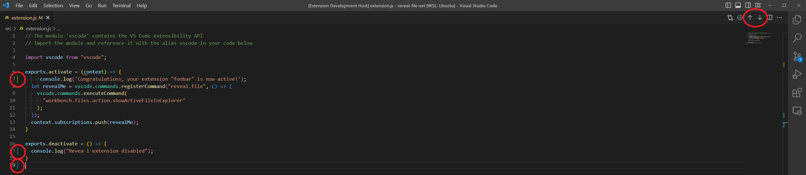

# diff-arrows README

Adds buttons to go to the next or previous git diff without first navigating to the compare editor. The folder must be a git repository for the buttons to be visible.

## Extension Settings

This extension contributes the following settings:

* `diff-arrows.enabled`: Enable/disable this extension.

## Requirements

## Known Issues
